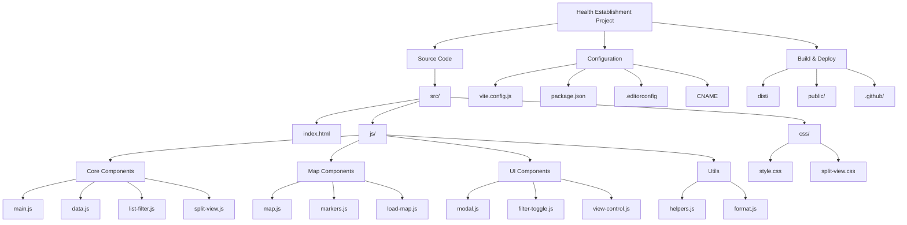

# Health Establishment Project

A web application for managing and displaying health establishments with interactive maps and filtering capabilities.

## Project Structure



## Key Components

- **Core Components**
  - `main.js`: Application entry point and initialization
  - `data.js`: Data management and storage
  - `list-filter.js`: List filtering functionality
  - `split-view.js`: Split view management

- **Map Components**
  - `map.js`: Map initialization and configuration
  - `markers.js`: Marker management for health establishments
  - `load-map.js`: Map loading utilities

- **UI Components**
  - `modal.js`: Modal dialog functionality
  - `filter-toggle.js`: Filter toggle controls
  - `view-control.js`: View control management

- **Utilities**
  - `helpers.js`: Common helper functions and DOM utilities
  - `format.js`: Data formatting utilities

- **Styles**
  - `style.css`: Main application styles
  - `split-view.css`: Split view specific styles

## Features

- Interactive map visualization of health establishments
- Advanced filtering and search capabilities
- Split view mode (map and list)
- Responsive design
- Detailed establishment information
- Custom markers and popups
- City-based filtering
- Text search functionality

## Development

This project uses Vite as the build tool and development server. To get started:

1. Install dependencies:
```bash
pnpm install
```

2. Available Scripts:
```bash
# Start development server
pnpm dev

# Build for production
pnpm build

# Preview production build
pnpm preview
```

3. Development Server Configuration:
```bash
# Start server with specific host
pnpm dev --host

# Start server with specific port
pnpm dev --port 3000

# Start server with both host and port
pnpm dev --host --port 3000
```

The development server runs on:
- Default port: 5173
- Auto-opens browser: Yes
- Host: All network interfaces (when --host flag is used)

## Dependencies

### Production Dependencies
- `leaflet`: Interactive maps library
- `@qwik.dev/partytown`: Web worker management

### Development Dependencies
- `vite`: Build tool and development server
- `@rollup/plugin-terser`: JavaScript minification
- `postcss-preset-env`: CSS processing
- `rollup-plugin-brotli`: Brotli compression
- `rollup-plugin-gzip`: Gzip compression
- `rollup-plugin-obfuscator`: Code obfuscation
- `rollup-plugin-terser`: Additional minification
- `terser`: JavaScript minifier
- `vite-plugin-compression`: Vite compression plugin

## Project Configuration

- **Build Tool**: Vite v6.2.5
- **Package Manager**: pnpm
- **Version Control**: Git
- **Deployment**: GitHub Pages (configured via CNAME)
- **License**: ISC
- **Repository**: [GitHub](https://github.com/tech-andgar/health_establishment)

### Build Configuration
- **Base URL**: /
- **Output Directory**: dist/
- **Minification**: Terser
- **Target**: ES2015
- **Source Maps**: Disabled
- **Code Splitting**: Enabled
- **Compression**: Gzip and Brotli
- **Obfuscation**: Enabled for data.js

## License

ISC License
