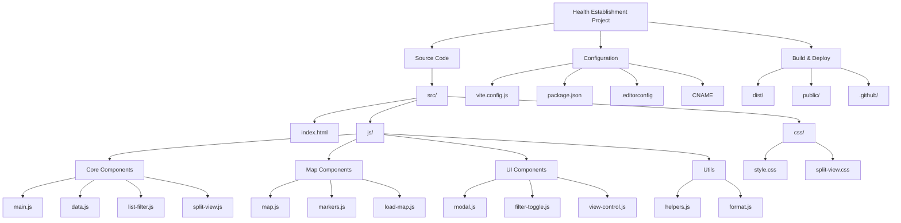

# Health Establishment Project

A web application for managing and displaying health establishments with interactive maps and filtering capabilities.

## Project Structure



## Key Components

- **Core Components**
  - `main.js`: Application entry point and initialization
  - `data.js`: Data management and storage
  - `list-filter.js`: List filtering functionality
  - `split-view.js`: Split view management

- **Map Components**
  - `map.js`: Map initialization and configuration
  - `markers.js`: Marker management for health establishments
  - `load-map.js`: Map loading utilities

- **UI Components**
  - `modal.js`: Modal dialog functionality
  - `filter-toggle.js`: Filter toggle controls
  - `view-control.js`: View control management

- **Utilities**
  - `helpers.js`: Common helper functions and DOM utilities
  - `format.js`: Data formatting utilities

- **Styles**
  - `style.css`: Main application styles
  - `split-view.css`: Split view specific styles

## Features

- Interactive map visualization of health establishments
- Advanced filtering and search capabilities
- Split view mode (map and list)
- Responsive design
- Detailed establishment information
- Custom markers and popups
- City-based filtering
- Text search functionality

## Development

This project uses Vite as the build tool and development server. To get started:

1. Install dependencies:
```bash
pnpm install
```

2. Available Scripts:
```bash
# Start development server
pnpm dev

# Build for production
pnpm build

# Preview production build
pnpm preview
```

3. Development Server Configuration:
```bash
# Start server with specific host
pnpm dev --host

# Start server with specific port
pnpm dev --port 3000

# Start server with both host and port
pnpm dev --host --port 3000
```

The development server runs on:
- Default port: 5173
- Auto-opens browser: Yes
- Host: All network interfaces (when --host flag is used)

## Dependencies

### Production Dependencies
- `leaflet`: Interactive maps library
- `@qwik.dev/partytown`: Web worker management

### Development Dependencies
- `vite`: Build tool and development server
- `@rollup/plugin-terser`: JavaScript minification
- `postcss-preset-env`: CSS processing
- `rollup-plugin-brotli`: Brotli compression
- `rollup-plugin-gzip`: Gzip compression
- `rollup-plugin-obfuscator`: Code obfuscation
- `rollup-plugin-terser`: Additional minification
- `terser`: JavaScript minifier
- `vite-plugin-compression`: Vite compression plugin

## Project Configuration

- **Build Tool**: Vite v6.2.5
- **Package Manager**: pnpm
- **Version Control**: Git
- **Deployment**: GitHub Pages (configured via CNAME)
- **License**: Non-Commercial with Attribution
- **Repository**: [GitHub](https://github.com/tech-andgar/health_establishment)

### Build Configuration
- **Base URL**: /
- **Output Directory**: dist/
- **Minification**: Terser
- **Target**: ES2015
- **Source Maps**: Disabled
- **Code Splitting**: Enabled
- **Compression**: Gzip and Brotli
- **Obfuscation**: Enabled for data.js

## License

### Software License
Copyright (c) 2024 Andrés García (TECH-ANDGAR)

This software is licensed under a Non-Commercial License with Attribution requirement (NC-BY). This license is based on Creative Commons Attribution-NonCommercial 4.0 International (CC BY-NC 4.0) principles.

#### Terms and Conditions:

1. **Non-Commercial Use**
   - The software cannot be used for commercial purposes without explicit permission
   - Commercial use includes but is not limited to:
     * Selling the software or its derivatives
     * Using the software in a commercial product or service
     * Using the software to generate revenue
   - Non-commercial use includes:
     * Personal projects
     * Educational purposes
     * Research
     * Non-profit organizations

2. **Commercial Use**
   - Commercial use of this software is not permitted under this license
   - For commercial licensing, please contact the author:
     * Email: dev@tech-andgar.com
     * Website: https://tech-andgar.me
   - Commercial licensing terms will be negotiated separately
   - A commercial license may include:
     * Usage rights
     * Modification rights
     * Distribution rights
     * Support options
     * Custom terms based on your needs

3. **Attribution Requirements**
   - Any use of this software must include proper attribution
   - Attribution must be visible and prominent
   - Attribution must include:
     * Original author's name: Andrés García (TECH-ANDGAR)
     * Link to author's website: https://tech-andgar.me
     * Link to the original repository: https://github.com/tech-andgar/health_establishment
     * Date of use

4. **Modifications and Derivatives**
   - Modifications are allowed for non-commercial purposes
   - All modifications must maintain the same license terms
   - Modified versions must clearly indicate changes from the original
   - The original author must be credited

### Data License
The data used in this project is sourced from [datos.gov.co](https://www.datos.gov.co) and is subject to the following terms:

1. **Data Usage Rights**
   - Data can be freely used, modified, and distributed
   - Commercial use of the data is permitted
   - Attribution to datos.gov.co is required

2. **Data Attribution Requirements**
   When using the data, you must include:
   ```
   Data sourced from datos.gov.co
   https://www.datos.gov.co
   Last accessed: 2025-04-08
   ```

### Compliance and Enforcement
- Violation of these license terms may result in legal action
- The copyright holder reserves the right to modify these terms at any time
- Continued use of the software after terms modification constitutes acceptance of the new terms

### Disclaimer
THE SOFTWARE IS PROVIDED "AS IS", WITHOUT WARRANTY OF ANY KIND, EXPRESS OR IMPLIED. IN NO EVENT SHALL THE AUTHORS OR COPYRIGHT HOLDERS BE LIABLE FOR ANY CLAIM, DAMAGES OR OTHER LIABILITY, WHETHER IN AN ACTION OF CONTRACT, TORT OR OTHERWISE, ARISING FROM, OUT OF OR IN CONNECTION WITH THE SOFTWARE OR THE USE OR OTHER DEALINGS IN THE SOFTWARE.
